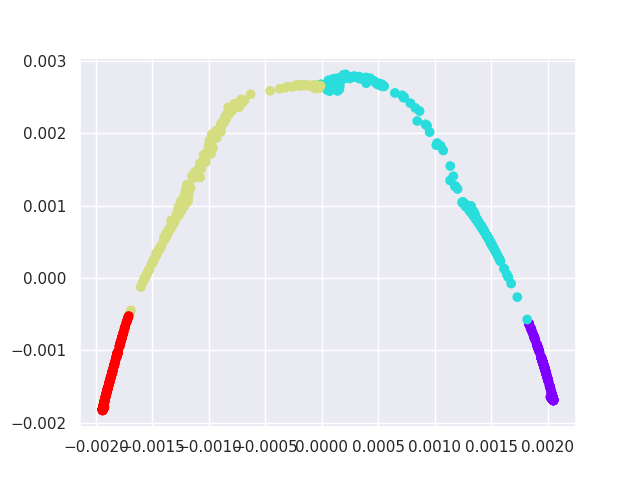

Manifold learning is an approach to non-linear dimensionality reduction.

**Course**: [Optimization Methods], Spring 2020 
**Taught by**: Prof. Jawahar C. V.

See [main.ipynb] for python notebook. You can edit it in [Colaboratory].

 
 
 
 
 
 
 
 
 
 
 
 
 
 
 
 
 

[Optimization Methods]: https://github.com/iiithf/optimization-methods
[Colaboratory]: https://colab.research.google.com
[main.ipynb]: main.ipynb
